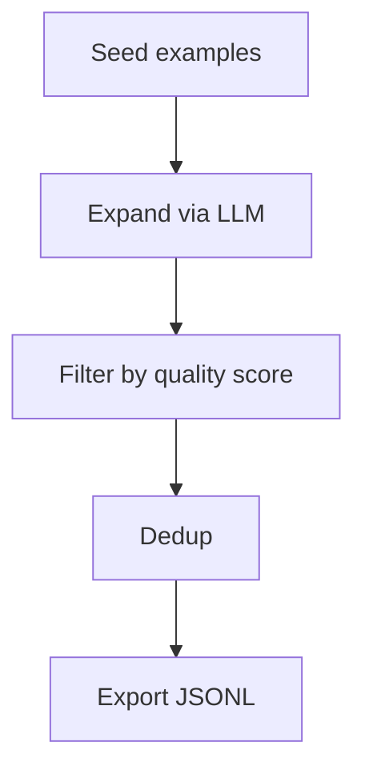

# Architecture

Four stages:

| Stage | Responsibility |
|---|---|
| **Expand** | Generates variants of each seed via LLM |
| **Filter** | Scores quality, drops low-scoring samples |
| **Dedup** | Removes near-duplicates by text similarity |
| **Export** | Writes clean JSONL ready for fine-tuning |
